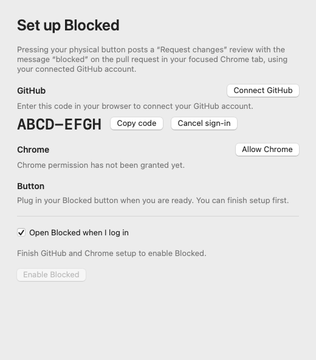

# Blocked for macOS

For soldering checks, use the separate [USB Button Tester](../docs/button-test.md):
a live pressed/released display and counter with no GitHub actions.

A small native menu bar app connects the USB button to the pull request in the active Google Chrome window. No browser extension or injected JavaScript is needed. The default review is **Request changes**, with the body **blocked**.

## Recipient experience

The gift should arrive **assembled, flashed and tested**. The recipient installs
Blocked from the disk image by dragging it into Applications, opens it once,
and completes its setup window:

1. **GitHub:** the app checks for an existing GitHub CLI sign-in and displays the
   account. If needed, **Connect GitHub** displays a one-time code and opens
   GitHub's browser authorization page. No Terminal, token copying, or Homebrew
   installation is required by the default app build. GitHub calls this the
   **GitHub CLI** authorization because the bundled helper owns the sign-in.
2. **Chrome:** choose **Allow Chrome** and accept macOS's Automation prompt.
   Blocked reads the focused tab URL, not page contents. If permission was
   previously denied, the setup window explains where to change it in Settings.
3. **Enable Blocked:** the window shows the selected action and message. Leave
   **Open Blocked when I log in** checked to keep it available after restarting
   the Mac. macOS may require approval in Login Items.
4. Plug in the pre-flashed button with a USB data cable, open a PR in Chrome,
   and press. No serial-port selection or per-launch arming is needed.

Unplugging and reconnecting starts a fresh USB session automatically. The app
rescans for the button while disconnected, so a changed USB port name is fine.
Leave Blocked running in the menu bar; installing it alone does not start a
process after you explicitly quit it. With **Open at login** enabled, it starts
again when you sign into your Mac. No BOOT or RESET press is needed for normal use.

For the single file to send to a friend, see [packaging and distribution](../docs/distribution.md).

Enabled/paused state survives app restarts. **Pause button** stops submissions
until enabled again. Changing action/message or advanced settings requires
accepting the new configuration once. GitHub sign-in and Chrome's permissions
remain controlled by GitHub and macOS; the app cannot skip those consent screens.
The GitHub account used can differ from the one signed into Chrome.

Success and error feedback appears briefly without activating Blocked or stealing
Chrome's focus. **Last result…** retains the full message. For diagnosis, choose
**Test next press (no review)**: that one physical press detects the PR and shows
its action without launching a review command. For repeated bench tests, keep
Blocked paused and select this option before each test press.



## Build and install

Development requires macOS 13+, Xcode/Swift 5.9+ and its selected command line
tools. The recipient does not need Xcode. There are no third-party Swift
packages. The default packaging script includes a pinned GitHub CLI executable
for Intel and Apple Silicon; archive SHA256 checks run before extraction and
on cached builds. Its MIT license ships with the app.

```sh
cd companion
swift test
./scripts/build-app.sh
```

Copy `dist/Blocked.app` to `/Applications`, then open it. The first packaging build
needs internet to download the verified helper archives. Later builds can use
`./scripts/build-app.sh --offline`. `--without-gh` is an explicit developer-only
option that uses an existing GitHub CLI installation; do not distribute that
variant as a self-contained app. See [bundled helper provenance](ThirdPartyNotices/GitHubCLI.md).

The helper reuses GitHub CLI's configuration and credential storage. Existing
Homebrew installations remain a fallback for developer builds. An absolute
helper path and serial port override remain available under Settings for
troubleshooting; neither is part of normal setup. Authentication output is
parsed in memory; device codes are not persisted. Cancel stops the sign-in
process, then rechecks whether credentials were saved before cancellation.

The script signs locally with an ad-hoc signature and stable bundle ID
`io.github.eoinest.blocked`. This is a **source-built prototype, not a notarized
installer**. A frictionless downloadable release still needs Developer ID
signing (`SIGNING_IDENTITY`), notarization and stapling, plus clean-Mac testing.
A rebuilt ad-hoc app may need Automation permission again. No login item is
registered by the build script: only enabling the setup checkbox or choosing
**Open at login** in the running app requests registration.

Chrome must be frontmost when the press is handled. Opening Blocked settings
means Chrome is no longer the target. Conversation, files (`/files` and `/changes`), commits and checks
views are supported; query strings and anchors are ignored when constructing
its canonical PR URL. Other browsers, Enterprise hosts, issues and arbitrary
subpaths remain unsupported. Chrome's “Allow JavaScript from Apple Events”,
Accessibility and Input Monitoring permissions are not required.

## What happens on a press

`USB CDC → identity + sequence check → foreground Chrome + active tab → strict PR URL parser → gh pr review`

The app uses `NSWorkspace.frontmostApplication` and read-only Apple events addressed to that exact process ID to read Chrome's front-window ID, active-tab ID, and URL. Addressing Chrome by bundle ID can select a separate background automation instance, so the reader never falls back to that lookup. It reads twice, requires matching results, and rejects reads taking one second or more. It then launches `gh` with a separate argument array, without a shell. The operation targets the captured PR URL. A tab switch after `gh` starts cannot recall the already-started network request.

There is no press queue. Busy presses, bursts, duplicate sequence numbers, data delayed by a blocked run loop/sleep, and presses inside the two-second debounce window are discarded. A live attempt reserves that PR for ten seconds, including failures. `gh` has a twenty-second timeout and is never retried automatically: a timeout may mean GitHub received the review but its response was lost. Check the PR before trying again. GitHub may reject self-reviews, closed PRs, or reviews the signed-in account cannot submit; those errors are shown as returned by gh.

No PR URL or review body is persisted by Blocked, except the configured message in macOS preferences. The latest result stays in memory. Subprocess output uses a private temporary directory removed on completion. User-supplied custom `gh` paths must point to an executable you trust.

## USB protocol v1

CDC serial, 115200 baud, 8 data bits, no parity, one stop bit, no hardware flow control. The host asserts **both DTR and RTS** because the ESP32 Arduino CDC connection implementation requires both. The firmware's USB product name is `Blocked Key`, using Espressif's vendor ID `0x303a` and the LOLIN S2 Mini's existing product ID `0x80c2`. Automatic discovery filters by vendor and product name; an explicitly configured `/dev/cu.*` port bypasses discovery only.

```text
host → board: HELLO\n
board → host: BLOCKED_KEY 1\n
board → host: PRESS 1\n
board → host: PRESS 2\n
host → board: RESULT DRY_RUN\n
host → board: RESULT OK\n
host → board: RESULT ERROR\n
```

Identity is a version/compatibility check, not cryptographic authentication. Sequence numbers must increase within a connection. A new connection starts a fresh session and flushes input. The host retries HELLO while awaiting identity; repeated identity responses do not reset the host's sequence check. The board requires a debounced release after handshaking before emitting a new press; holding the key while plugging it in cannot submit a review. Result lines are optional feedback and can be ignored by the board.

## Verification

`swift test` runs the offline regression suite and skips the opt-in Chrome integration test.
Coverage includes URL boundaries, exact window/tab identities, application or tab
changes during capture, slow reads, dry run without even looking up gh, busy
presses, per-PR failure cooldowns, and the production press coordinator through a
real local fake-gh subprocess. Runner tests check exact `--request-changes` and
`blocked` arguments, authentication/self-review/permission errors, silent failures,
interruptions, noninteractive execution, timeouts and no automatic retries.
These default tests make no network calls and never submit reviews. Additional
tests cover remembered enable/pause state, setup readiness, browser device-code
parsing, existing-account checks, cancellation, timeout, and stale auth callbacks.

For a real Chrome smoke test, close any sensitive modal dialogs and leave the
desktop idle, then run from `companion`:

```sh
BLOCKED_CHROME_INTEGRATION=1 swift test --filter ChromeIntegrationTests
```

This opens two disposable Chrome windows, switches a tab, checks PR versus issue
URLs, verifies rejection when Finder is foreground, and closes its own windows.
It restores the previously active app. macOS can request Automation permission for
the test runner. The fixture URLs need not resolve to real PRs; this tests URL
detection, not remote PR existence. It never invokes gh or submits a review.
If macOS prevents foreground activation, `BLOCKED_CHROME_INTEGRATION=reader`
tests real Apple-event window/tab responses with an injected foreground identity;
that mode **does not verify actual foreground-app detection**.

The Swift app and packaging can be built without hardware. A fresh recipient Mac
still needs its own first-run and physical unplug/replug checks. A test runner's
Automation permission does not establish that the packaged app has permission.
See the root bring-up instructions.

### Local verification — September 7, 2026

- Physical switch → ESP32 USB → packaged companion → focused Chrome PR → GitHub
  request-changes review with body `blocked` passed on the assembled device.
  The user confirmed success and dismissed the test review afterward.
- Fixed targeting when background Chrome automation processes share the same
  bundle ID as the visible browser; all reads now address the captured PID.
- Changed the per-PR cooldown to ten seconds and verified its boundary tests.
- The development app uses the user's existing GitHub sign-in; distributed
  artifacts contain the app and bundled CLI, not credentials or preferences.

### Local verification — September 5, 2026

- **Passed:** 43 offline tests, including the production press flow through fake gh.
- **Passed:** universal release build, Apple Silicon/Intel architecture check,
  and strict code-signature verification.
- **Unresolved:** the live Chrome smoke test could not establish its disposable
  window as the front window. Full-focus mode also encountered another foreground
  app. Reader-only mode still observed a different Chrome window after attempting
  to raise the fixture, so neither live mode is recorded as passing. The test
  cleaned up its fixture windows. Rerun interactively on an idle desktop.
- **Not performed:** any real GitHub review submission, packaged-app permission
  onboarding, or physical USB-button test.

Testing also fixed empty error messages from silent gh failures, added an explicit
ambiguous-result message for interrupted gh processes, and corrected the `lipo`
argument order in the optional CI template. That template remains inactive until
installed under `.github/workflows` with appropriate GitHub permissions.

## Primary references

- [Apple: frontmostApplication](https://developer.apple.com/documentation/appkit/nsworkspace/frontmostapplication)
- [Chromium: AppleScript support](https://www.chromium.org/developers/design-documents/applescript/) — installed Chrome's `Contents/Resources/scripting.sdef` additionally declares `active tab`, `URL`, and window/tab IDs.
- [Apple: NSAppleEventsUsageDescription](https://developer.apple.com/documentation/bundleresources/information-property-list/nsappleeventsusagedescription)
- [Apple: Apple Events entitlement](https://developer.apple.com/documentation/bundleresources/entitlements/com.apple.security.automation.apple-events)
- [GitHub CLI: gh pr review](https://cli.github.com/manual/gh_pr_review)
- [ESP32 Arduino: LOLIN board definitions](https://github.com/espressif/arduino-esp32/blob/3.3.1/boards.txt) and [USB CDC implementation](https://github.com/espressif/arduino-esp32/blob/3.3.1/cores/esp32/USBCDC.cpp)
