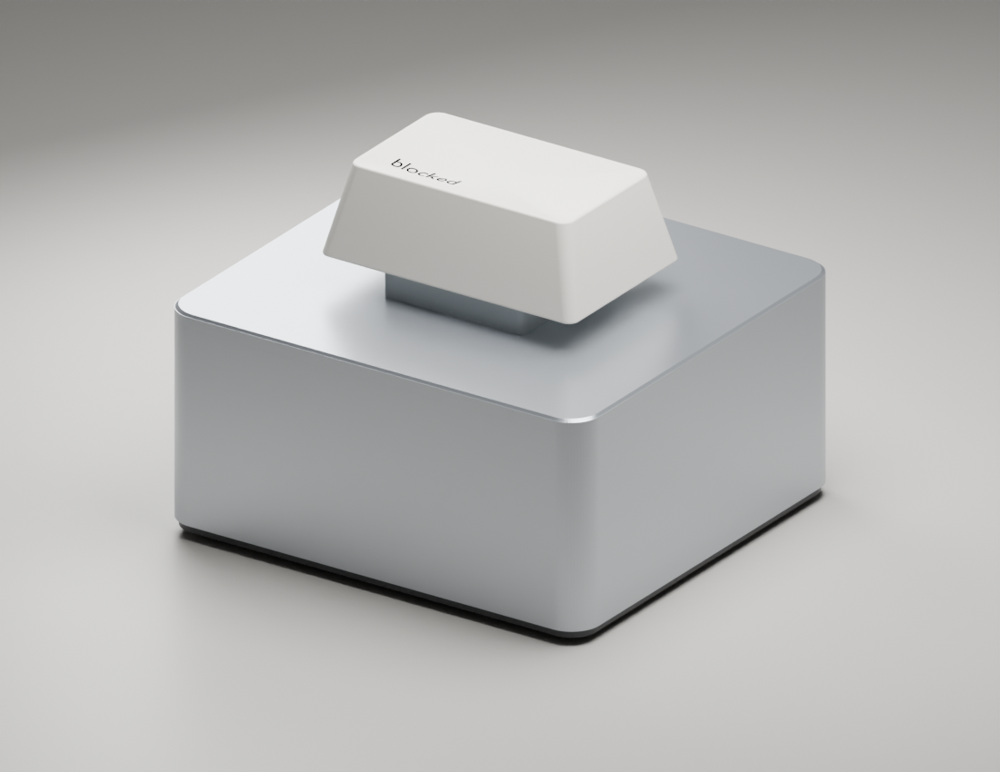
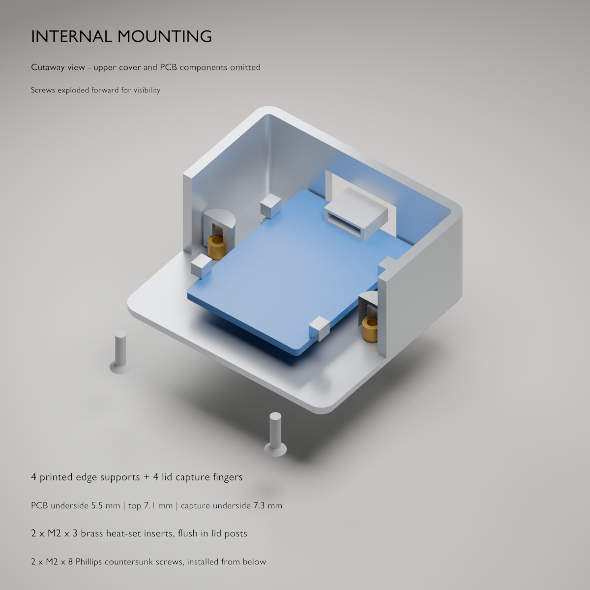
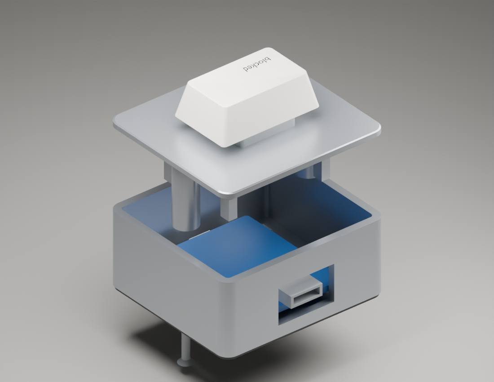

# Printable enclosure

This is a **46 × 42 × 22 mm** two-piece case for a **headerless LOLIN S2 mini**, a standard full-height MX switch, and a purchased **1.5u keycap, approximately 28 mm wide**. The assembled render is about 34 mm tall including its illustrative keycap. The recommended switch and wiring are covered in [hardware.md](hardware.md).

The revised design takes visual cues from the [physical Cursor Tab button](https://www.linkedin.com/posts/jonathanbraude_the-cursor-tab-has-arrived-activity-7358934314186657793-v_f7): a satin silver pedestal, an ivory sculpted key, a small dark legend, and a clean top without visible fasteners. These are our own enclosure dimensions and geometry; the design does not reproduce Cursor branding. The keycap is 10 mm wider than the original 1u concept, with a tapered skirt and shallow dish shown in the reference model.



**Status: digitally checked prototype, not physically fit-tested.** Mesh validation checks connected solids, positive volume, and non-manifold edges. It does not verify your board, switch clips, cable, printer tolerances, or assembly. Start with the switch and insert coupons and measure the actual board before printing the full case.

## Mounting system and exact screws

The **base's printed cradle supports the ESP32**, and **four fingers on the lid capture its edges** when the case is closed. Two screws secure the lid, so the board needs no separate screws or mounting tape. The MX switch clips into the lid's 1.5 mm plate; the purchased Tab keycap pushes onto the switch stem. Four adhesive-backed feet sit in the bottom recesses for desk grip.

| Quantity | Hardware | Where it goes |
| --- | --- | --- |
| **2** | **M2 × 0.4 × 8 mm**, 90° countersunk Phillips machine screws, **PH1** drive; [BelMetric MSF2X8SS](https://belmetric.com/phillips-flat-head-stainless-m2x0-4-coarse-din-965/) | From the bottom of the base into the lid posts. **8 mm includes the head**. |
| **2** | **M2 × 3 mm brass heat-set inserts**, **3.6 mm OD**; [CNC Kitchen TC-M2x3.0](https://cnckitchenus.store/products/heat-set-insert-m2-x-3-100-pieces) | One in each lid post, flush with the post's lower end. |

Use these insert dimensions: other M2 inserts can have different outside diameters and lengths. The insert bore is sized for the selected part, with printer compensation checked using the insert coupon. The board lifts out after removing the lid. There are no screws through the PCB and no loose nuts.



The cutaway is an explanatory view; print the complete base and lid STL files.

## Files and editing in Blender

- [blocked.blend](../enclosure/blocked.blend) is the editable Blender model. Open it in Blender, expand `PRINTABLE`, and select `base` or `lid` for mesh editing. `REFERENCE ONLY` contains approximate purchased parts, including the screws and inserts; `STUDIO` contains the camera and lights. Both coupons are hidden in the viewport and can be unhidden from the Outliner. The saved view opens on the assembled camera composition.
- [base.stl](../enclosure/stl/base.stl), [lid.stl](../enclosure/stl/lid.stl), [fit-coupon.stl](../enclosure/stl/fit-coupon.stl), and [insert-coupon.stl](../enclosure/stl/insert-coupon.stl) are exported in **millimeters**, oriented for printing. The lid STL is upside down relative to assembly, with its top face on the print bed.
- [parameters.json](../enclosure/parameters.json) and [build.py](../enclosure/build.py) are the parametric source. The script builds Blender meshes and renders the scene. It also generates [blocked.scad](../enclosure/blocked.scad) from the same geometry tree for an optional OpenSCAD workflow.
- [mesh-validation.json](../enclosure/mesh-validation.json) records dimensions, topology, and volume for the exported meshes. The STL exports include the lid's modeled perimeter chamfer and the base's inset bottom band. They exclude the additional render-only edge highlights and all reference objects.

From the repository root, regenerate all geometry with the installed Blender:

```sh
# macOS; change the executable path for another installation or OS.
/Applications/Blender.app/Contents/MacOS/Blender \
  --background --factory-startup --threads 4 \
  --python enclosure/build.py -- --export
```

Use Blender 4 or newer; the included artifacts were generated in Blender 5.2.1. No Python packages or add-ons are required. Regeneration overwrites the generated `.blend`, `.scad`, STL files, images, and validation report, so save manual Blender edits under another filename first. Edit the JSON for repeatable dimensional changes. Its parameters are intended for small fit adjustments; substantial size changes also require checking the locator, pad, and screw layout in the script.

To regenerate only the optional OpenSCAD file, run `python3 enclosure/build.py`. In OpenSCAD choose `part = "base"`, `"lid"`, `"fit-coupon"`, or `"insert-coupon"`, render, and export. Blender is the main design and preview workflow.

## Mechanical layout

| Feature | Default geometry |
| --- | --- |
| Body envelope | 46 mm wide × 42 mm deep × 22 mm high |
| Base | 20.5 mm high; 2 mm wall and floor; 3 mm outside corner radius |
| Lid and switch flange | 1.5 mm plate, 14.1 × 14.1 mm square MX aperture |
| Top edge | 0.3 mm high perimeter chamfer; the switch flange remains 1.5 mm |
| Lid registration skirt | 2 mm deep; 0.3 mm clearance per side; 1.2 mm wall |
| Lid screws | Two M2 × 8 mm, 90° countersunk machine screws, inserted from underneath into brass inserts |
| Screw locations | x = ±17.5 mm, y = 0; 6.4 mm post outside diameter |
| Screw holes | Lid post: 3.4 mm diameter × 3.2 mm deep insert seat, plus 2.4 mm tip relief to 6.5 mm total depth; base floor: 2.2 mm clearance and about 4.2 mm underside head recess |
| Lid post reach | Ends 2.3 mm above the outside bottom, leaving 0.3 mm above the 2 mm floor |
| Lower edge | Bottom 0.8 mm is inset by 0.4 mm per side; dark color is an optional finish |
| Board envelope | 25.4 mm across x × 34.3 mm along y; center y = +1.5 mm |
| PCB support | Printed edge ledges; no mounting tape |
| Nominal PCB underside | 5.5 mm above outside bottom |
| PCB retention | Four integral lid fingers; 0.6 mm edge overlap, nominal 0.2 mm lift clearance over a 1.6 mm PCB |
| Rear cable opening | 16 mm wide × 10 mm high, bottom 4 mm above outside bottom |
| Desk pad recesses | Four 8 × 8 mm rounded pockets, 0.5 mm deep |

The positive-y side is the USB side. The board rests on the cradle's rigid ledges, while side guides, the front stop, and rear wall limit horizontal movement. Four lid fingers overlap the board's outer edges to limit upward movement without squeezing it. They are positioned away from the central switch and USB socket. Two posts descend beside the board; underside screws engage their brass inserts, leaving the visible top free of screw holes. Route the two switch wires between these features, with nothing trapped beneath a finger.

At the default dimensions, the posts have 1.6 mm clearance to the bare PCB edge and 0.3 mm clearance to the inside case wall. An 8 mm countersunk screw reaches about 5.7 mm into the post if its head is flush: through the 3 mm insert and into the relief bore. The selected 3.8 mm head may sit about 0.15 mm below the 4.2 mm countersink mouth, leaving approximately 0.65 mm of screw-tip clearance. Keep the relief open; the tip must not bottom out before the case closes. The heads should sit flush or slightly recessed, and the lid must seat without forcing it.

The official WEMOS documentation specifies the [S2 mini board footprint](https://www.wemos.cc/en/latest/s2/s2_mini.html) as 34.3 × 25.4 mm, with a [dimension drawing](https://docs.wemos.cc/en/latest/_static/files/dim_s2_mini_v1.0.0.pdf). The Gateron [Baby Kangaroo 2.0 manufacturer drawing](https://gateron.com/u_file/2308/29/file/GATERONBabyKangaroo20Switch-b4b5.pdf) is the switch reference. The 14.1 mm opening includes a small print allowance; choose its actual value with the coupon rather than assuming all printed MX plates fit identically.



The keycap, switch, PCB, USB shell, screws, and inserts are visual references, **not manufacturing models**. The cap has no functional MX socket and is not exported as an STL; purchase the 1.5u Tab cap in the BOM. The PCB reference uses the published footprint and assumes a 1.6 mm thickness. It omits components, solder joints, buttons, antenna details, switch pins, and wires. Fastener references show position and envelope, not working threads. Do not use these references as proof of fit with a populated board or print them as purchased parts.

## Measure and print a coupon first

1. Confirm your board is actually the 34.3 × 25.4 mm S2 mini layout. S2/S3/C3 boards and clones can differ. Remove headers for this case; it is not sized for Dupont plugs or stacked headers.
2. Measure PCB thickness, the tallest components on both sides, USB socket location, and your cable's overmold. The PCB bottom is 5.5 mm above the case bottom. The capture fingers end at z = 7.3 mm, leaving 0.2 mm above a nominal 1.6 mm PCB. Adjust the capture height for your board; the lid must not press it down. The USB opening spans z = 4–14 mm. Check that the plug can fully seat through the opening; the PCB's nominal USB end is about 2.35 mm inside the outer rear wall.
3. Print the coupon at 100% scale, with 0.1 mm layers so the 1.5 mm flange prints accurately. Its holes are **14.0, 14.1, 14.2 mm**, marked with **one, two, three** small edge notches respectively. Start with the middle hole. The switch should press in firmly and its retaining clips should latch underneath without cracking the plate. Change `switch_opening` to the best fit and regenerate if needed. Lightly remove first-layer elephant's foot before judging fit.
4. Inspect both sides of the PCB where the cradle and fingers meet it: near x = ±12.1–12.7 mm and y = ±10 mm, relative to case center, with 3 mm contact length along y. These contact zones must be flat and clear of components, solder joints, and wires. Adjust `retention_y`, `retention_depth`, and `retention_overlap` before printing if needed. Set `board_thickness` to the measured thickness and retain clearance using `retention_clearance`. The 0.6 mm overlap is provisional; do not force a lid over a conflicting component or a soldered lead.
5. Check the switch's lowest pin/center-post point and tallest PCB component with the parts dry-stacked. Target at least **2 mm clearance**, including solder and insulated wires. If needed, increase `base_height` instead of compressing or bending the assembly together. This is especially important with a five-pin switch and bulky solder joints.

6. Print the **insert coupon** in the same material and orientation as the lid posts. Its seats are marked with **one, two, three, four notches** for **3.2, 3.3, 3.4, 3.5 mm**, respectively. The selected insert's nominal hole is 3.2 mm; the initial `insert_seat_diameter` is 3.4 mm to allow for printed-hole shrinkage. Choose a seat where the pilot just pre-seats with slight resistance, then heat-set it flush and verify the screw runs freely after cooling. Set `insert_seat_diameter` to that choice and regenerate. [CNC Kitchen's sizing guidance](https://www.cnckitchen.com/blog/are-our-heat-set-insert-datasheets-wrong) explains why the final CAD diameter depends on the printer and material.

## Printing

PETG is a useful first choice for the lid's repeated switch insertion and mounting features; PLA is fine for a desk prototype. Use a 0.4 mm nozzle, 0.1 mm layers for the lid and coupons, and 0.16–0.2 mm layers for the base. Start with four walls, five floor layers, and 20–30% infill. Check the slicer's wall paths around the insert seats, capture fingers, switch hole, and screw heads.

Print the base floor-down and the lid top-down as supplied in the STLs. The base's rear USB opening requires a 16 mm bridge, and its underside pad pockets require short 8 mm bridges. A tuned printer can do these without supports; use local support under the USB bridge if your printer cannot bridge cleanly, and remove it before inserting the board. No internal support should remain around the PCB. The lid's registration skirt faces upward during printing.

The supplied lid mesh is **19.7 mm tall on the print bed** because the long screw posts point upward when it is printed top-down. The assembled case is still 22 mm tall because the posts and registration skirt fit inside the base. The posts print vertically without support. The base's bottom inset forms only a 0.4 mm overhang at 0.8 mm height.

The render shows a satin silver finish with a charcoal inset band and ivory purchased cap. A printed plastic case will not inherently look like machined aluminum: silver filament gives a simpler approximation, or sand/prime and apply a suitable metallic finish. The dark bottom band can be painted or printed with a color change in the first 0.8 mm. Color is optional and does not affect assembly.

## Assembly and desk grip

1. Before fitting electronics, use a soldering iron to heat-set one M2 × 3 mm insert into each lid post, flush with its lower end. Keep each insert square; use the successful coupon and the insert supplier's installation guidance. Let both cool completely. Verify the screws run freely and the tip-relief bores remain clear. Dry-fit the empty lid; its skirt and posts should enter without bowing or rubbing.
2. Flash and test the board while it is accessible. Solder the switch wires with the board unplugged, use heat-shrink over exposed switch terminals, and leave a small service loop. Fit the switch into the lid before wiring it if that makes the leads easier to handle.
3. Place the board in the printed cradle, USB facing the rear opening. It should rest flat on all intended contact areas. Dry-fit the lid and confirm the four fingers capture the board edges with a small clearance. The lid must seat under gentle hand pressure before any screws are tightened. If the PCB bends or the lid rocks, correct the interference first.
4. Route the insulated leads clear of the switch, PCB components, cradle, capture fingers, posts, and lid skirt. Seat the lid, hold the assembly together, and insert the two M2 × 8 mm countersunk screws **from underneath** into the brass inserts. Tighten only until the lid is secure and the heads are flush or slightly recessed; do not use the screws to pull a misfitting lid closed. Fit the purchased 1.5u Tab keycap and verify full travel and return, including off-center presses.
5. Cut the BOM's Type D rubber pads into four 8 × 8 mm feet, rounding their corners to fit the underside pockets. A 1 mm pad projects about 0.5 mm below the case. Rubber feet provide friction; they do not stick the object to the desk. If you want desk adhesion, use small removable double-sided gel pads instead, checking compatibility with the desk finish. Keep the two functions distinct when buying pads.
6. Plug in the actual cable and press repeatedly. The case should stay seated, the cap should clear the lid throughout travel, and neither the board nor USB socket should shift. Unplug and inspect the first assembly for pin contact or pinched wires before treating the gift as finished.

BOOT and RESET remain internal; removing the two underside screws provides service access. The foot pockets do not cover those screws. Headers, a battery, LEDs, and hot-swap sockets are intentionally outside this version's mechanical envelope. The final fit still requires a real printed coupon and a board-in-case trial.
