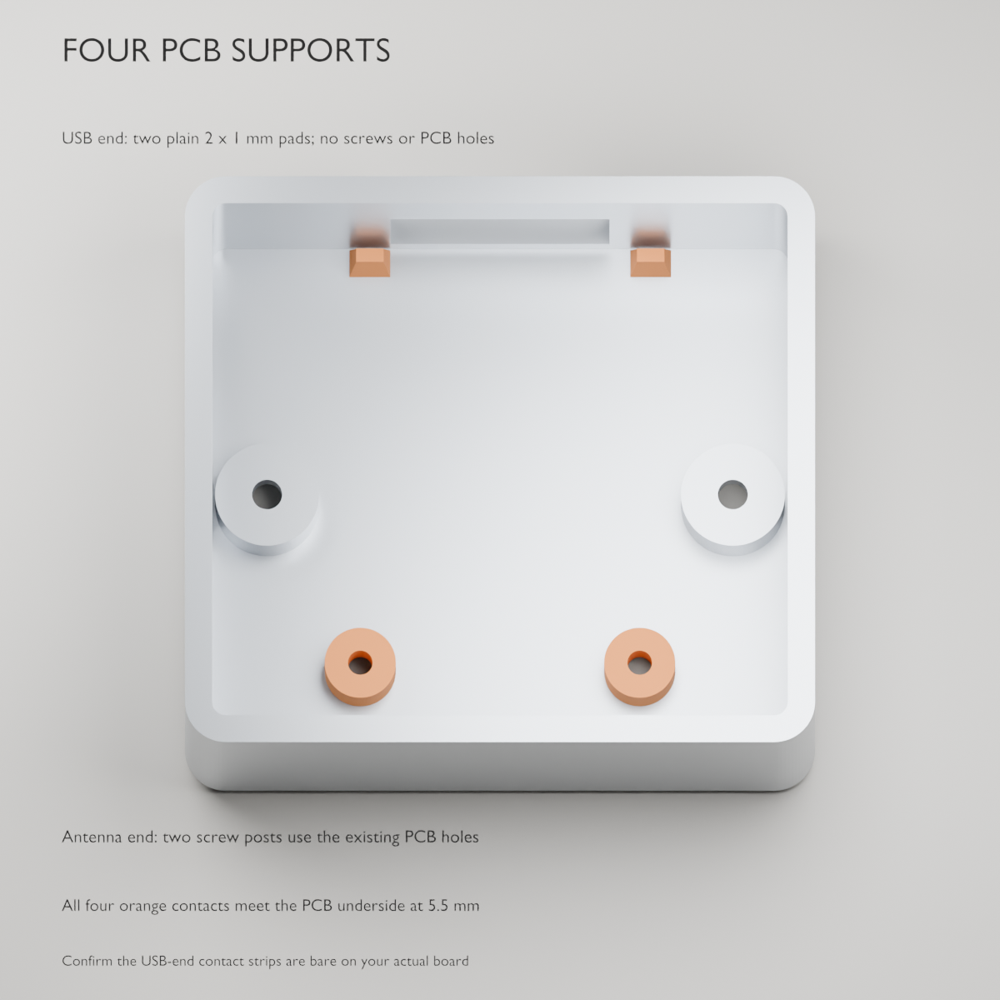

# Printable enclosure and mounting

The revised case is **46 × 42 × 22 mm** before the exposed nuts/keycap. It uses the same S2 Mini board, snap-in Gateron switch and 1.5u Tab cap. This revision responds to the assembled prototype: covered nuts were awkward to fit, and the two-point PCB support allowed flex.

**All four screws now enter from underneath. All four nuts are open from above.** The PCB has four support locations, all at **z = 5.5 mm**. The two antenna-end supports retain the existing mounting holes; the two USB-end supports are plain bearing pads with no holes or screws. The revised parts have nominal geometry checks; the new print has not yet been physically fitted.


## Mounting and hardware

| Quantity | Part | Installation |
| --- | --- | --- |
| 2 | **M1.6 × 6 mm socket-cap screws**, 0.35 mm pitch | Up through the bottom of the base and the two existing Ø2 mm PCB holes |
| 2 | M1.6 hex nuts, modeled AF3.5 × 1.3 mm | Rest openly on top of the PCB; accessible with the lid off |
| 2 | **M2 × 20 mm socket-cap screws**, 0.4 mm pitch | Up through the bottom of the base and lid |
| 2 | M2 hex nuts, modeled AF4 × 1.6 mm | Rest openly on top of the lid |

Lengths exclude the heads. These are **different lengths from the previous M1.6 × 4 / M2 × 8 design**. Check the compartments in your [ordered Maierke kit](https://www.amazon.com/dp/B0GKFMJH24?th=1); inclusion of 6 mm M1.6 and 20 mm M2 screws has not been confirmed. Reuse its matching nuts. Both nominal screw heads use a 1.5 mm hex key.

There are **no captive pockets, roofs over nuts, or side-loading slots**. Hold an exposed nut with fine pliers while turning its screw from below. Remove the press-fit keycap for easier access to the two case nuts. The modeled nut-to-cap gap is enough for the parts themselves, not a guarantee that a socket wrench fits between them. No washers, inserts or adhesive are required by this nominal stack.

The switch still snaps into the 1.5 mm plate and the keycap presses onto its MX stem. See [key mounting](key-mounting.md).

## Board supports and clearances

Coordinates use the case bottom as z = 0 and USB toward +y.

| Feature | Revised dimensions / location |
| --- | --- |
| PCB outline | 25.4 × 34.3 mm, centered at y = 1.5 mm |
| PCB underside / top | z = 5.5 / 7.1 mm, assuming 1.6 mm PCB thickness |
| Antenna-end mounting supports | x = ±10.2, y = −12.35 mm; use the two original Ø2 mm holes |
| USB-end left contact | 2 × 1 mm at x = −9.5, y = 17.9 mm |
| USB-end right contact | 2 × 1 mm at x = 11.0, y = 17.9 mm |
| All four support tops | z = 5.5 mm |
| PCB bottom head recesses | Ø3.6 mm, 2.8 mm deep |
| Case bottom head recesses | Ø4.4 mm, 4.4 mm deep; local pad top z = 6.2 mm |
| Exposed PCB nuts | z = 7.1–8.4 mm; nominal screw tips z = 8.8 mm |
| Exposed case nuts | z = 22.0–23.6 mm; nominal screw tips z = 24.4 mm |
| Feet | Four 8 × 8 mm recesses at x = ±17, y = ±15 mm, moved clear of all screw entries |
| Switch / USB aperture | 14.1 mm square × 1.5 mm plate / 16 × 10 mm cable opening |



The small USB-end contact patches were chosen from the official board underside photo to avoid the button anchor/solder regions. They are near the two corners and supported from the base. **Check that these patches touch bare PCB on your actual clone**, not a solder joint or component. No electrical header holes are used for mounting. The source model preserves access around all 32 GPIO holes and the USB connector; solder and your wire routing are not fully modeled.

The board should rest evenly without rocking before nuts are fitted. All four contacts have the same nominal height; do not tighten the screws to force a bowed board onto a high printed support. See the [component accuracy record](component-accuracy.md) and [fastener stack audit](fastener-fit.md).

## Files and Blender workflow

- [blocked-print-plate.stl](../enclosure/stl/blocked-print-plate.stl): **revised base and lid in one print file**, floor/top-down respectively, 6 mm apart.
- [blocked-print-plate-with-coupons.stl](../enclosure/stl/blocked-print-plate-with-coupons.stl): base, lid, switch and fastener coupons together.
- [blocked.blend](../enclosure/blocked.blend): editable Blender assembly. PRINTABLE contains case parts and coupons; other collections are component references.
- [base.stl](../enclosure/stl/base.stl), [lid.stl](../enclosure/stl/lid.stl): individual print-oriented parts.
- [case-fastener-coupon.stl](../enclosure/stl/case-fastener-coupon.stl): exposed-nut M2 × 20 stack with Ø4.2/4.4/4.6 head entries.
- [board-fastener-coupon.stl](../enclosure/stl/board-fastener-coupon.stl): exposed-nut M1.6 × 6 stack with Ø3.4/3.6/3.8 head entries and a nominal PCB-thickness stand-in.
- [fit-coupon.stl](../enclosure/stl/fit-coupon.stl): switch openings 14.0/14.1/14.2 mm.

From the repository root:

```sh
/Applications/Blender.app/Contents/MacOS/Blender --background --factory-startup --threads 4 --python enclosure/build.py -- --export
/Applications/Blender.app/Contents/MacOS/Blender --background --factory-startup --threads 4 --python enclosure/check-assembly.py
/Applications/Blender.app/Contents/MacOS/Blender --background --factory-startup --threads 4 --python enclosure/print-layout.py
```

The generator updates Blender, OpenSCAD, individual STLs and diagrams. Rebuild combined plates afterward. The independent checker verifies hardware direction/length, exposed nut access, bottom head entries, bearing material, four PCB contacts, and nominal component clearances. The September 8 revision passed 1,312 nominal collision/access pairs and 53 feature audits; all five individual printable meshes are single-body and manifold. Reports do not establish actual print strength or clone fit.

## Print and assemble

1. Use the revised **base and lid together**; do not mix with the old captive-nut parts. For the Bambu A1 with a 0.4 mm nozzle, use PLA, four walls and five floor layers, about 0.16 mm layers for the base and 0.10–0.12 mm for the lid/coupons. Inspect small counterbore bridges and the USB opening in the slicer.
2. Test the fastener coupons with the actual new-length screws. Heads should pass freely, and nuts should engage fully on their open top surfaces. No nut pocket needs cleaning or press-fitting.
3. With USB unplugged, seat the board on all four supports. Verify the two USB-end pads contact bare board and do not press on solder. Align the two existing mounting holes.
4. Insert the **M1.6 × 6 screws from underneath**, place the M1.6 nuts openly on top of the PCB, hold each nut and tighten gently. Check the board remains flat and all GPIO pads/wires clear the supports.
5. Seat the switch and lid, leaving wire slack for service. Insert **M2 × 20 screws from underneath** and fit the two M2 nuts openly on the lid. Hold the nuts while tightening; stop if the lid does not sit freely. Press the keycap on after tightening.
6. Add feet at the relocated corner recesses. All four screw entries must remain accessible. Check key travel, connector insertion/removal and board flex, then reconnect USB.

## RESET / BOOT service access

**The first version uses disassembly, with no exterior button holes or extra
parts.** The two underside case screws remain clear of the feet. Remove those
screws and lift the lid with its switch and keycap still attached; the cap does
not need removal just to open the case. Support the lid beside the base rather
than leaving it hanging from its wires.

RESET restarts the board. BOOT (marked **0** on some S2 Minis) selects the ROM
downloader when held during reset. Hold BOOT, tap/release RESET, then release
BOOT once the USB downloader appears. See the [LOLIN instructions](https://docs.wemos.cc/en/latest/tutorials/s2/get_started_with_arduino_s2.html)
and [firmware flashing guide](../firmware/README.md#flash). This firmware disables
the serial-line reboot shortcut, so physical access is needed for later uploads
as well as first assembly. A routine restart can also be done by unplugging and
reconnecting USB, with BOOT released.

1. Quit the companion and disconnect USB before opening the case.
2. Remove the two case screws, support the lid, and expose the USB end of the
   board. Locate the actual RESET and BOOT actuator faces using the board labels.
   The current Blender references show side-facing buttons near the USB end;
   exact positions and travel on the purchased clone remain unmeasured.
   The nominal side gaps are about **8.75 mm at RESET** and **7.75 mm at BOOT**,
   with the actuator centres about **12.15 mm below the rim**. This favors a
   narrow tool over fingers. The modeled channels lie behind the electrical
   header rows and clear the case posts; keep wires out of these channels.
3. Confirm a finger or blunt nonconductive tip can reach each actuator without
   levering against the PCB or pulling the wire joints. Do not force a tool
   through the USB opening. If access is awkward, unplug USB and remove the two
   PCB mounting screws too; service the supported board outside the base.
4. Reconnect USB only once the board and lid are stable on a nonconductive work
   surface. Perform the BOOT/RESET sequence and upload. Disconnect USB again
   before refitting any screws and closing the case.

**Assembly acceptance check:** before finalizing wire lengths, demonstrate this
opening and flashing sequence. Leave enough service slack for the lid to clear
the buttons and be supported beside the base, and make sure that same slack
fits inside without touching clips, pins or screw posts. The wires in Blender
are illustrative routes, not a validated service loop. Lid-off finger/tool
access and board flex are also not yet physically verified.

If closed-case access becomes necessary, investigate **two recessed side-wall
holes**, aligned to the measured lateral actuators. Bottom holes cannot provide
a direct route through the PCB, and top holes do not align with these modeled
side-facing plungers. Hole locations, tool clearance and a travel limit must be
checked on the actual board before changing the printable base; no hole diameter
or location is released as fabrication-ready yet. Preserve access to both
controls and keep the GPIO pads and USB connector clear.

No headers, battery, hot-swap socket or extra circuit board are included in this envelope.


