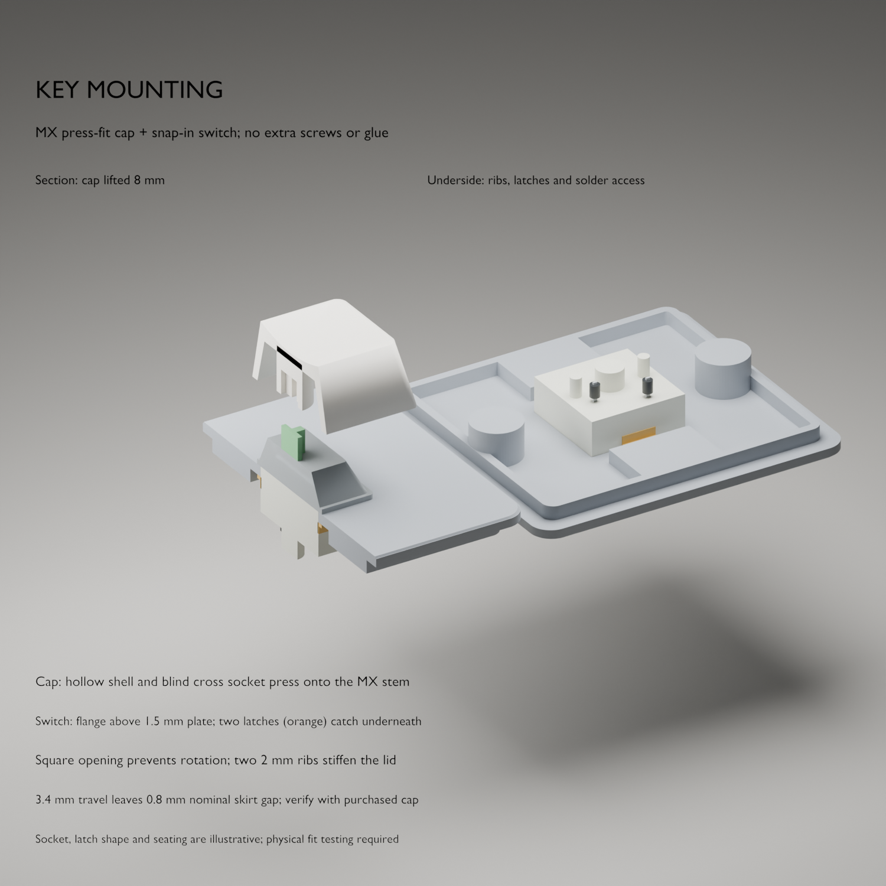

# Switch and Tab keycap mounting

The key uses a **plate-mounted Gateron Baby Kangaroo 2.0 and a single centred MX socket in the 1.5u Tab cap**. The lid carries the key's mechanical loads; the electrical wires and ESP32 board do not support it. No additional screws, glue, stabilizer, switch PCB or hot-swap socket are required by this design.

**Prototype status:** the plate, ribs and service clearances are designed here. The purchased switch's clip details and the Max Keyboard cap's socket are explanatory references where exact dimensions are unavailable. Fit must be checked using the actual switch and cap.

## What holds each part

| Interface | Retention and load path | Release / inspection |
| --- | --- | --- |
| Cap → moving stem | The cap's moulded cross socket presses onto the switch's MX cross. The cross transmits off-centre presses and resists rotation. | Pull the cap straight upward while supporting the switch housing; do not lever against the lid or twist the stem. |
| Switch → lid, downward | The housing flange rests on the top face around the square aperture. Pressing force passes from flange into lid. | Flange must sit flat on every side, with no trapped wire or print debris. |
| Switch → lid, upward | Two spring clips on opposite sides of the switch latch beneath the plate. They prevent the switch lifting out during use. | Remove the lid and compress the switch's plate-retaining clips, then push the housing up through the aperture. Do not confuse them with the housing-disassembly tabs. |
| Switch → lid, sideways | The square body fits the square aperture and limits rotation and lateral movement. | Tune aperture fit using the coupon; a loose switch is not fixed by tightening the case screws. |
| Lid → enclosure | Two underside ribs stiffen the deck near the key. The perimeter skirt registers the lid, and the existing M2 case screws retain it. | Remove the two screws underneath and lift the lid only as far as the wire service loop allows. |

The flange and clip arrangement is the standard plate-mount mechanism. The five-pin switch's three plastic locating posts are intended for a keyboard PCB; they remain free in this hand-wired build. The two metal pins carry electrical connections only. See the [Gateron drawing](https://gateron.com/u_file/2308/29/file/GATERONBabyKangaroo20Switch-b4b5.pdf) and [Gateron's switch-removal guidance](https://www.gateron.com/blog/detail/gateron-3-in-1-customization-tool).

## Plate and reinforcement

| Feature | Nominal design |
| --- | --- |
| Manufacturer aperture specification | 14.00 mm +0.05/−0.02; actual target 13.98–14.05 mm |
| Printed aperture CAD | 14.1 × 14.1 mm initially; coupon alternatives 14.0 / 14.1 / 14.2 mm compensate for the printer |
| Manufacturer plate specification | 1.50 mm +0.01/−0.05; actual target 1.45–1.51 mm, kept free of underside ribs |
| Switch flange | 15.9 × 15.7 mm from the Gateron drawing |
| Flange overlap at 14.1 mm opening | Approximately 0.9 mm per side in x and 0.8 mm per side in y |
| Reinforcing ribs | Two integral 12 × 9.1 × 2 mm ribs, centred at x = 0, y = ±14.05 mm |
| Rib position | Below the plate, extending toward the front and rear registration skirt; clear of the electrical header columns |
| Switch travel | 3.4 mm maximum for the selected Baby Kangaroo 2.0 |

These aperture and plate tolerances come from the recommended-mounting section of the [Gateron specification](https://gateron.com/u_file/2308/29/file/GATERONBabyKangaroo20Switch-b4b5.pdf). **14.1 mm is a CAD starting value for print compensation, not the manufacturer's specified finished opening.** Measure the printed coupon and clip land.

The aperture remains square and its bearing edges are not enlarged for a decorative chamfer. A thicker plate directly under the switch clips can prevent them from latching, so reinforcement sits farther away. Rib stiffness and latch retention still need a physical test; mesh clearance is not a strength calculation.

The cap is removable and has no added rigid guide around its skirt. A guide sized from an approximate keycap model could rub or jam at full travel. The intended 1.5u cap uses one centred switch; confirm the purchased cap's socket position and test both ends. The [Omnitype size table](https://intercom.help/omnitype/en/articles/5121683-keycap-sizes) lists 1.5u Tab without a stabilizer; a conventional 2u stabilizer is not part of this layout.

## Fit, solder and assemble

1. Print the [switch coupon](../enclosure/stl/fit-coupon.stl) with the intended filament and lid settings. It reproduces the 1.5 mm clip land. One/two/three notches identify the 14.0/14.1/14.2 mm apertures.
2. Insert the bare switch from above. Select the opening that lets the flange sit flat and both clips spring fully beneath the plate. Check from below. The housing must not rock or lift with a gentle upward pull. Reject a fit requiring excessive force or leaving either latch compressed.
3. Try the cap on the coupon-mounted switch. Support the housing and press straight over the stem. Check free return after full presses at the centre, left and right ends. Confirm the cap seats securely and does not touch the plate or switch housing during travel. Do not glue the socket or sand the switch stem to compensate for a mismatched cap.
4. Update `switch_opening` from the coupon result, regenerate, and print the lid top-down. The two ribs are integral to the lid. Keep the clip land clean and check its actual thickness; do not thicken it with adhesive or paint. Test the M2 fastener coupon and slide the lid's two M2 nuts into their pockets before adding the switch or wires, following the [enclosure guide](enclosure.md).
5. Clip the switch into the lid **before soldering**, with the light-guide side toward the rear/USB side as shown in Blender. Support the lid with the stem free of pressure. Follow the [wiring guide](hardware.md), insulate both metal terminals and keep the clips accessible.
6. Route enough wire slack to lift the lid for service. The loop must not pull on the terminals or run through a clip, screw, key-travel region or PCB mounting hole. Dry-fit the lid and check at least 2 mm between exposed switch joints and board components.
7. Close the case with its existing M2 screws, then install the cap while supporting the assembly. Test repeated centre and off-centre presses and inspect the flange for movement. Check for lid flex, stem sticking, skirt rubbing or incomplete return. If any occurs, reopen and correct the fit before use.

For maintenance, unplug USB and remove the cap while supporting the switch. Open the case, support the lid, and release both plate clips from below to remove the switch. Desolder its wires if replacing it. Never use the wires or solder pins as handles. A keycap puller or switch puller is optional; it does not replace checking the clips from below on this hand-wired assembly.

## What the Blender view proves

The section shows the mounting sequence and the nominal plate/rib geometry. Separate references show the cap at rest and after 3.4 mm of travel, plus space for reaching the clips with the lid removed. The independent [assembly check](../enclosure/assembly-validation.json) checks the modeled case, rib and access clearances.

The current illustrative cap has a nominal 0.8 mm skirt-to-lid gap at full travel. Its moulded socket dimensions, seating depth and nesting around the switch's upper housing are **not manufacturer-verified**. This is not a printable keycap or a guarantee that the selected cap clears. Obtain the [missing dimensions](../keycap/dimensions-request.md), or measure a blank from the same mould, before declaring exact fit. The switch's own mechanism determines end of travel; the lid must not become the travel stop.
