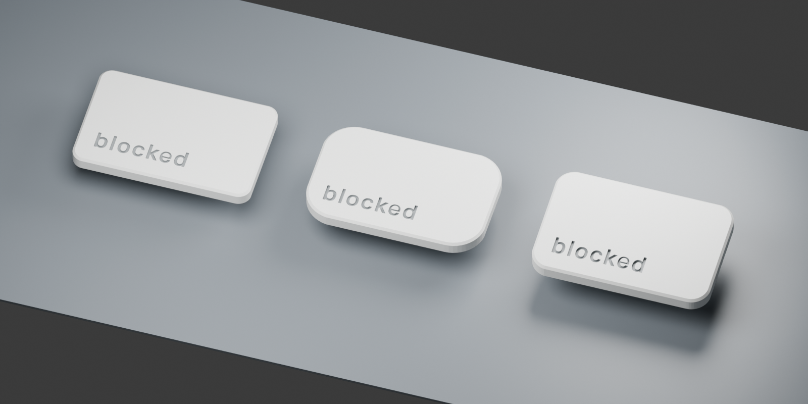

# Print a `blocked` Tab keycap

Three slim **28 × 18 mm, 1.5u-style Tab prototypes** for the selected Gateron Baby
Kangaroo 2.0 switch. They push onto its cross stem; no keycap screw, glue or
stabilizer is needed. The switch itself still clips into the enclosure's lid.
These are purpose-designed printable caps, separate from the illustrative
purchased-keycap model in `enclosure/`.



The render shows optional gray paint in the engraving. A single white filament
prints the whole cap, including the recessed lettering; an AMS is not needed.

## Files to print

- **[Bambu Studio A1 project](blocked-tab-all-options.3mf)**: open as a project
  to retain the arranged parts and supplied process settings. Select your
  actual PLA spool and plate, then **Slice plate** and inspect the preview.
- **[All options, one STL](stl/blocked-tab-all-options.stl)**: nine caps and three
  socket testers, already laid out face-down on a **98 × 92.68 mm** footprint.
- **[Socket testers only](stl/socket-fit-coupons.stl)**: the quickest first print.
- Individual caps and testers are in [stl/](stl/).
- **[Editable Blender source](blocked-tab-options.blend)** includes the arranged
  print plate and hidden copies in installed orientation.

Import in **millimeters, 100% scale**. Preserve the supplied orientation. The
caps' upper faces are against the bed and their sockets point upward. Do not
auto-orient them. The combined STL has 12 deliberately separate shells; keep
their relative positions if the slicer asks about importing multiple objects.
This plate contains keycaps and socket testers only, not the enclosure parts.

| Shape | Underside IDs | Shape choice |
| --- | --- | --- |
| A — Flat Tab | A0, A1, A2 | Closest to the restrained Apple-style outline; 2 mm corner radius |
| B — Soft Tab | B0, B1, B2 | Softer 5 mm corners, same flat pressing face |
| C — Tilt Tab | C0, C1, C2 | Face slopes up 5° toward the back; 3 mm corners |

All have a 2.4 mm crown and 0.35 mm edge chamfers. C is rotated by 175° for
printing so its sloped face lies flat on the bed. A/B and the testers are
rotated 180°. The lack of a surrounding skirt leaves more room around the
switch housing. These are individual button shapes, not replicas of an OEM
keyboard row profile.

In the STL's XY layout, columns left-to-right are A, B, C. Rows from lower to
higher Y are fits 0, 1, 2. Three smaller F0/F1/F2 testers occupy the last row.
Each piece also has a recessed ID underneath.

## Bambu Lab A1 settings

Designed around the **stock 0.4 mm nozzle and regular PLA**. The printer model
is confirmed; nozzle and material are assumptions. Use the material preset
that matches the actual spool. Avoid silk PLA for this small spring-fit socket.

| Setting | Use |
| --- | --- |
| Printer | Bambu Lab A1, 0.4 mm nozzle |
| Process baseline | 0.12 mm High Quality |
| Layer height / first layer | 0.12 mm / 0.20 mm |
| Wall generator | Arachne |
| Walls / infill | 4 walls / 100% infill |
| Supports / raft / brim | Off / off / none |
| Outer walls / first layer | 30 mm/s / 20 mm/s |
| Elephant-foot compensation | 0 mm for this face-down plate; the crown has an edge chamfer |
| Ironing | Off — the visible face is on the bed |
| Scale and orientation | 100%, as supplied |

Use a clean plate and run the appropriate flow calibration for the filament.
A smooth plate gives the most keyboard-like upper face; the A1's textured PEI
plate works but transfers its texture to the cap and small lettering. Set the
actual plate type in Bambu Studio and retain the matching filament/plate
temperature preset. This design doesn't require a new plate.

The engraving is **0.4 mm deep**, with a 14.1 mm-wide lowercase word expanded
outward by 0.07 mm. Added letter spacing and a 0.15 mm enlargement of the tiny
`e` counter preserve details that the first A1 slice lost. This is a
print-adapted version of the SF Compact artwork,
not the finer 9 mm-wide vendor upload. Preview the first few layers: the holes
inside letters must remain present. Do not put supports into the socket or
enable a global XY-size adjustment to tune it: that also changes the exterior.

A **0.2 mm A1 nozzle is an optional improvement** for lettering and thin socket
walls. If using one, select its real printer/nozzle profile, use 0.08–0.12 mm
layers, and repeat the socket test. A smaller layer height on the 0.4 mm nozzle
alone does not give it a 0.2 mm nozzle's XY detail. Do not reuse a sliced 0.4 mm
project unchanged with different hardware.

The [A1 process preset](a1-process.json) and [slicer verification report](slicer-validation.json)
record the checked settings and results. The 3MF is an editable, unsliced
project. The standard STL also works in other slicers with the settings above.

Bambu Studio 2.8.2.61 estimates **1 h 22 min 40 s and 14.32 g of PLA** for the
whole plate with the supplied settings (65 layers). Its final toolpaths retain
all seven separate engraved letters and all four letter centers on all nine
caps in both first layers. The inspected socket paths stay open, and no model
warnings were reported. These are slicer checks and estimates, not a completed
physical print; the report lists the inspection limits and profile metadata
warnings.

## Choose the fit before assembly

The numeric suffix controls the **total extra width**, not clearance per side:

| Fit | Horizontal pocket thickness | Through-slot width | Starting order |
| --- | --- | --- | --- |
| 0 | 1.10 mm | 1.30 mm | Tightest |
| 1 | 1.20 mm | 1.40 mm | Middle |
| 2 | 1.30 mm | 1.50 mm | Try first, roomiest |

The horizontal pocket's span is 4.10 mm. The perpendicular slot opens through
both ends of a **5.2 mm diameter boss**, creating two compliant halves joined
above the 3.6 mm-deep recess. The root widens above 3.8 mm. Wall thickness near
the pocket corners is roughly 0.47–0.49 mm: inspect these features rather than
assuming a manifold STL guarantees a strong print.

1. Let the print cool and inspect the socket. Remove loose strings only; do not
   drill, glue or force it onto the stem.
2. With USB disconnected, support the switch body and try **F2** gently by hand,
   then F1 and F0 if needed. Keep the X/Y orientation: the two cross-bar widths
   differ. Do not rotate a cap 90° to make it fit.
3. Choose the fit that seats securely and can be removed with a straight pull
   without excessive force. A tester that bottoms on the guard instead of
   seating on the cross does not pass. If none fits, measure the printed socket
   and switch and adjust the geometry; don't scale the whole cap.
4. Fit the corresponding A/B/C cap. F testers use the flat print orientation;
   the tilted C socket must also be checked because it prints at 5° to Z.
5. Press fully at the center and each corner, then release repeatedly. Confirm
   the full stroke, free spring return, no rubbing, no cracks and no unseating.
   Stop if it sticks or the root touches the surrounding guard/housing.

**Physical fit has not been verified.** Gateron documents the cross and travel,
but does not dimension the surrounding guard's inside clearance, the cap's
female socket or its seating depth. The 5.2 mm boss, 3.6 mm engagement and axial
seat are testable prototype choices. The testers deliberately expose those
uncertainties before relying on a finished cap.

With the existing assembly's *assumed* male cross top 8.4 mm above the plate,
seating at the recess ceiling puts the socket mouth at 4.8 mm. At full 3.4 mm
travel it is 1.4 mm above the plate. The crown remains at least about 0.94 mm
above the modeled 5 mm housing top; the root flare starts 0.2 mm above it.
The narrow boss still enters the housing's undimensioned central opening.
These nominal clearances do not establish the actual installed height or fit.

## Why these shapes and print choices

There is no universally perfect printed keycap. A finger dish can feel nice,
but it introduces a curved overhang when printed face-down. Printing it with
the socket down instead compromises the small fit surfaces or needs supports.
For a first A1 batch, broad planar faces let all three shapes use the same
support-free approach while comparing corner feel and face angle. Try the
physical prints to choose the most comfortable one.

- [Gateron's Baby Kangaroo 2.0 drawing, last page](https://gateron.com/u_file/2308/29/file/GATERONBabyKangaroo20Switch-b4b5.pdf)
  specifies 4.00 +0.05/−0.10 mm cross spans, 1.10 ±0.04 / 1.30 ±0.04 mm bar
  thicknesses and 3.4 mm maximum travel. Those asymmetric dimensions informed
  the socket; unmarked dimensions were not treated as exact.
- [KeyV2's stem implementation](https://github.com/rsheldiii/KeyV2/blob/master/src/stems/cherry.scad)
  demonstrates opening one arm through the socket for compliance. Its
  [dimensions](https://github.com/rsheldiii/KeyV2/blob/master/src/functions.scad)
  and [printing notes](https://github.com/rsheldiii/KeyV2/blob/master/TIPS_AND_TRICKS.md)
  show why stem fit and first-layer effects need tuning. We use that concept
  with original Blender geometry and Gateron-oriented dimensions; no KeyV2
  source code or mesh is bundled.
- [Prusa's design guidance](https://help.prusa3d.com/article/modeling-with-3d-printing-in-mind_164135)
  explains orientation, tolerances and wall/extrusion width. Its
  [nozzle comparison](https://blog.prusa3d.com/everything-about-nozzles-with-a-different-diameter_8344/)
  distinguishes XY detail from layer height.
- [Craig Andrews' documented keycap experiments](https://candrews.integralblue.com/2024/03/3d-printing-high-quality-keycaps/)
  are useful practical evidence for fine nozzles, tilted sculpted-cap printing
  and avoiding weak silk-PLA sockets. They are not measurements of this switch.
- [Bambu's A1 quick-start guide](https://cdn1.bambulab.com/documentation/quick-start-a75adcb1d5d5e/Quick%20Start%20Guide%20for%20A1.pdf)
  documents the supplied 0.4 mm nozzle. Slicing uses the official
  [Bambu Studio](https://github.com/bambulab/BambuStudio) A1 profiles.

## Reproduce and inspect

Run from the repository root using Blender 5.2.1 (tested):

```sh
/Applications/Blender.app/Contents/MacOS/Blender \
  --background --factory-startup --threads 4 \
  --python keycap/printed/build.py
```

The generator exports every cap, both combined plates, the Blender file,
preview and [mesh report](validation.json). Each printable part must be one
closed, manifold, positive-volume solid. It stops exporting on a failed check.
The STL units are mm; the Blender scene uses a 0.001 m unit scale.

Run the separate exported-file check with
`python3 keycap/printed/check-exported.py`. Its [independent report](independent-audit.json)
checks binary STL topology, volume, bed contact, part spacing and component
matching, and recovers the nominal crown/root travel clearances from the
exported geometry. It does not measure the real switch or certify socket fit.

The widened glyph contours are checked in, so Blender needs no extra Python
packages. Only when changing the artwork, regenerate them with:

```sh
uv run --with shapely==2.1.2 python keycap/printed/prepare-legend.py
```

All dimensions are in `build.py` and `validation.json`. The original
[vendor upload artwork](../README.md) is unchanged. No font binary is included.
